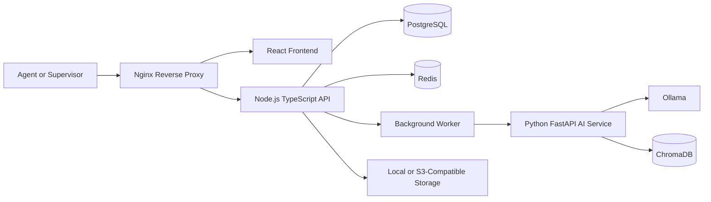
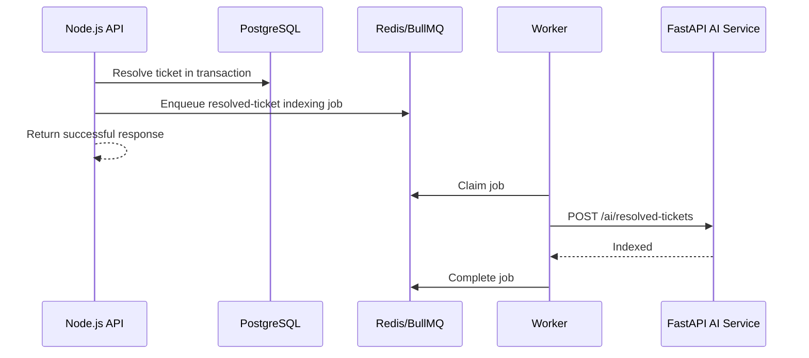

# NexusDesk Non-Serverless Migration Plan

## Can NexusDesk Be Converted?

Yes. NexusDesk can be converted from AWS Lambda and API Gateway into a conventional, always-running application without rewriting the whole project.

The current backend already separates Lambda handlers, business services, and repositories. The migration should preserve the React frontend, ticket business rules, tenant isolation, and Python AI service while replacing the serverless entry points and AWS-specific persistence.

## Recommended Target Architecture

Use a containerized modular monolith for the main API and keep the AI workload as a separate Python service.



### Recommended Components

| Current component | Non-serverless replacement |
|---|---|
| AWS API Gateway | Nginx plus Express or Fastify routes |
| AWS Lambda handlers | One long-running Node.js TypeScript API container |
| DynamoDB | PostgreSQL with Prisma or Drizzle ORM |
| Cognito | Keycloak, Auth0, or application-managed JWT authentication |
| EventBridge or Lambda events | Redis and BullMQ background jobs |
| CloudWatch | OpenTelemetry, Prometheus, Grafana, and structured logs |
| S3 | MinIO locally; S3-compatible storage in production |
| SAM and CloudFormation | Docker Compose locally and deployment manifests for a VM or Kubernetes |
| API Gateway WebSocket | WebSocket or Socket.IO server inside the Node.js API |

## Why This Architecture?

- The application gains a familiar HTTP server with predictable request handling.
- PostgreSQL supports relational reporting, filtering, joins, and transactional updates.
- Long-running containers avoid Lambda cold starts.
- Local and production environments can use the same container images.
- Existing TypeScript services and Python AI code can be reused.
- The modular monolith is simpler to operate than introducing many microservices immediately.

Do not split every backend module into a separate service during the initial migration. Tickets, users, tenants, calls, and audit logs have closely related workflows. Keep them in one Node.js application until scale or team ownership creates a clear reason to separate them.

## Proposed Repository Structure

```text
backend/
  src/
    server.ts                  # Starts the HTTP server
    app.ts                     # Creates and configures the application
    config/
    middleware/
      authenticate.ts
      authorizeRole.ts
      errorHandler.ts
    module/
      auth/
        auth.controller.ts
        auth.routes.ts
        auth.service.ts
      ticket/
        ticket.controller.ts
        ticket.routes.ts
        ticket.service.ts      # Reuse current business logic
        ticket.repository.ts   # Replace DynamoDB implementation
      tenant/
      user/
      call/
    jobs/
      queue.ts
      indexResolvedTicket.job.ts
    database/
      client.ts
      migrations/
      schema.ts
  Dockerfile

ai-service/                    # Keep the existing FastAPI service
frontend/                      # Keep the existing React application
nginx/
  nginx.conf
docker-compose.yml
```

## Migration Principles

1. Keep the public API behavior stable while changing infrastructure behind it.
2. Migrate one infrastructure dependency at a time.
3. Keep `tenantId` derived from the authenticated identity, never from an untrusted request body.
4. Preserve the current service layer and replace adapters around it.
5. Add characterization tests before changing working behavior.
6. Run the old and new implementations in parallel until data and API responses match.

## Phase 0: Confirm Scope and Baseline

Before changing architecture:

- List every implemented endpoint and mark planned endpoints separately.
- Record current request bodies, responses, status codes, and authentication behavior.
- Add integration tests for login and ticket create, list, get, update, and resolve flows.
- Add tests proving that one tenant cannot access another tenant's records.
- Export representative DynamoDB data for migration testing.
- Measure baseline latency and resource usage for comparison.

**Exit criteria:** Existing behavior is covered by repeatable tests, and the team agrees on which roadmap features are outside the migration.

## Phase 1: Introduce a Long-Running Node.js API

Add Express or Fastify to the TypeScript backend and create `app.ts` and `server.ts`.

Create conventional routes such as:

```text
POST   /api/auth/login
POST   /api/auth/signup
POST   /api/auth/confirm
POST   /api/auth/refresh
POST   /api/tickets
GET    /api/tickets
GET    /api/tickets/:ticketId
PATCH  /api/tickets/:ticketId
GET    /health
```

Initially, route controllers may adapt Express or Fastify requests into calls to the existing services. Avoid copying business logic from `ticket.service.ts` into controllers.

### Handler Conversion Example

The current request flow is:

```text
API Gateway event -> Lambda handler -> service -> DynamoDB repository
```

The new flow becomes:

```text
HTTP request -> route/controller -> service -> repository
```

Move these responsibilities out of Lambda-specific code:

- Read path parameters from `request.params`.
- Read JSON from `request.body`.
- Read authenticated identity from `request.user`.
- Return responses through the framework response object.
- Send unexpected errors to centralized error middleware.

**Exit criteria:** The long-running API exposes the current ticket routes and passes the same contract tests while still using DynamoDB and Cognito.

## Phase 2: Convert Authentication Middleware

First, continue using Cognito tokens so HTTP migration and identity migration do not happen simultaneously.

Replace the Lambda `authorize()` wrapper with framework middleware that:

1. Reads the bearer token from the `Authorization` header.
2. Verifies the JWT.
3. Resolves the role from token groups or claims.
4. Extracts `custom:tenantId`.
5. Stores a typed identity in `request.user`.
6. Rejects missing tenants, invalid tokens, and insufficient roles.

After the HTTP API is stable, choose one identity direction:

### Option A: Keep Cognito

This is the lowest-risk option. A conventional backend can still verify Cognito JWTs. Using one managed AWS service does not make the application architecture serverless.

### Option B: Replace Cognito With Keycloak

Use Keycloak when fully self-hosted identity is required. Create one realm, define `admin`, `supervisor`, and `agent` roles, and include `tenantId` in token claims. Configure PostgreSQL as Keycloak's database.

### Option C: Manage Authentication in the Node.js API

Store users and password hashes in PostgreSQL and issue short-lived access tokens plus rotated refresh tokens. This gives full control but creates additional security and maintenance responsibility. Prefer Keycloak unless custom authentication is a core project requirement.

**Exit criteria:** All protected routes receive a verified user, role, and tenant ID through framework middleware.

## Phase 3: Add PostgreSQL Alongside DynamoDB

Introduce PostgreSQL without immediately removing DynamoDB. Use Prisma or Drizzle to define the schema and migrations.

### Suggested Core Schema

```text
tenants
  id, name, created_at, updated_at

users
  id, tenant_id, identity_provider_id, email, name, role, status,
  created_at, updated_at

tickets
  id, tenant_id, customer_name, customer_email, subject, description,
  resolution, status, priority, category, assigned_to, sentiment,
  escalation_risk, created_at, updated_at

calls
  id, tenant_id, ticket_id, agent_id, customer_number, status,
  duration_seconds, started_at, ended_at, notes

audit_logs
  id, tenant_id, ticket_id, user_id, action, details, created_at
```

Add the following constraints and indexes:

- Foreign keys between tenants, users, tickets, calls, and logs.
- An index on `(tenant_id, status, created_at)`.
- An index on `(tenant_id, assigned_to, created_at)`.
- An index on `(tenant_id, customer_email)`.
- Check constraints for ticket statuses and other controlled values.
- A unique user email rule appropriate to the identity model.

Every repository method must require `tenantId`. Use queries shaped like:

```sql
SELECT *
FROM tickets
WHERE tenant_id = $1 AND id = $2;
```

Never fetch by ticket ID alone and apply the tenant check afterward.

**Exit criteria:** PostgreSQL migrations run automatically in development, and repository integration tests prove tenant isolation.

## Phase 4: Replace DynamoDB Repositories

Create PostgreSQL repository implementations behind the same service-facing contracts.

Migrate in this order:

1. Tenants
2. Users
3. Tickets
4. Calls
5. Audit logs

Use one of these cutover strategies:

### Recommended: Backfill, Dual Write, Compare, Cut Over

1. Backfill existing DynamoDB records into PostgreSQL.
2. Temporarily write mutations to both databases.
3. Continue reading from DynamoDB while comparing sampled PostgreSQL results.
4. Switch reads to PostgreSQL after validation.
5. Stop DynamoDB writes after an agreed rollback period.

Dual writes can partially fail, so log discrepancies and provide a reconciliation job. If no production data exists yet, skip dual writing and use a one-time import followed by direct cutover.

**Exit criteria:** All application reads and writes use PostgreSQL, migrated record counts match, and DynamoDB is no longer required at runtime.

## Phase 5: Add Asynchronous Background Jobs

The current resolved-ticket update calls the AI service directly and treats indexing failure as non-blocking. Replace that direct operation with a durable job.

Recommended flow:



For stronger consistency, use the transactional outbox pattern:

- Save the ticket update and an outbox event in one PostgreSQL transaction.
- A worker publishes pending outbox events to BullMQ.
- Mark an event as published only after successful enqueueing.
- Configure retries, exponential backoff, and a failed-job queue.
- Make AI indexing idempotent using tenant ID and ticket ID.

The worker can later handle notifications, email, report generation, and call-processing tasks.

**Exit criteria:** Resolving a ticket remains successful when the AI service is unavailable, and queued indexing resumes after recovery.

## Phase 6: Add Real-Time Features

Run Socket.IO or a standard WebSocket server in the Node.js API.

- Authenticate the initial connection with the same JWT verifier.
- Place users into tenant-specific rooms.
- Publish ticket changes only to the matching tenant room.
- Use Redis Pub/Sub if multiple API instances need to share WebSocket events.
- Add client reconnection and missed-event recovery.

**Exit criteria:** Two clients in the same tenant receive updates, while clients in another tenant receive nothing.

## Phase 7: Containerize the Complete Platform

The root Docker Compose stack should eventually contain:

```text
frontend
nginx
api
worker
postgres
redis
ai-service
ollama
chroma
minio              # Optional until attachments are implemented
keycloak           # Only if Cognito is replaced
```

Add health checks and explicit dependency readiness. Store database, model, vector, and object-storage data in named volumes. Keep secrets in environment files for local development and a secret manager in production.

Suggested network exposure:

- Expose only Nginx publicly.
- Keep PostgreSQL, Redis, ChromaDB, Ollama, and internal service ports private.
- Route `/api` and `/socket.io` to the Node.js API.
- Serve the built React application through Nginx.

**Exit criteria:** `docker compose up` starts a working application with no LocalStack, SAM, Lambda, API Gateway, or DynamoDB dependency.

## Phase 8: Observability and Operations

Add operational features before production cutover:

- Structured JSON logging with request and tenant correlation IDs.
- OpenTelemetry tracing across Nginx, Node.js, worker, and FastAPI.
- Prometheus metrics for HTTP latency, errors, queue depth, job failures, and AI latency.
- Grafana dashboards and alerts.
- PostgreSQL backups and tested restore procedures.
- Readiness and liveness endpoints.
- Graceful shutdown for API and worker containers.
- CPU and memory limits for Ollama and AI workloads.
- Rate limiting and request-size limits at Nginx or API middleware.

Do not write access tokens, passwords, ticket descriptions, or customer data to logs.

## Phase 9: Deployment

### Simple Portfolio or Small Production Deployment

Use one Linux virtual machine with Docker Compose:

- Nginx terminates TLS.
- Containers restart through Docker policies or systemd.
- PostgreSQL data is stored on an encrypted volume.
- Nightly backups are copied to separate storage.
- CI builds versioned images and deploys through SSH.

This is the easiest architecture to explain and operate, but the VM is a single failure domain.

### Production Deployment With Higher Availability

Use Kubernetes or multiple virtual machines:

- Run at least two API replicas and separate workers.
- Use a managed or replicated PostgreSQL cluster.
- Use Redis with persistence or a managed Redis provider.
- Use a load balancer in front of Nginx or an ingress controller.
- Configure autoscaling, rolling deployments, disruption budgets, and secret management.

Kubernetes adds significant operational cost. Adopt it only when availability, traffic, or organizational requirements justify it.

## Phase 10: Remove Serverless Infrastructure

Remove AWS-specific components only after the new stack has passed its rollback window:

- Lambda handler bundles and Lambda-specific build logic
- API Gateway resources
- DynamoDB tables and repository clients
- SAM and CloudFormation deployment resources
- LocalStack services that are no longer used
- Lambda event and response types
- Cognito resources, only if identity was migrated

Archive migration exports and infrastructure templates according to the project's retention policy before deleting cloud resources.

**Exit criteria:** The application builds, tests, deploys, and operates without serverless runtime dependencies.

## Recommended Implementation Order for This Repository

1. Add characterization tests around the current ticket service and handlers.
2. Add Fastify or Express and expose a `/health` route.
3. Create HTTP controllers for auth and tickets that call the existing services.
4. Convert authorization from a Lambda wrapper to HTTP middleware.
5. Update the frontend base URL to the new `/api` routes.
6. Add PostgreSQL, ORM schema, and migrations.
7. Replace the ticket repository first and verify tenant isolation.
8. Migrate tenant and user repositories, followed by calls and logs.
9. Add Redis, BullMQ, and a resolved-ticket indexing worker.
10. Add WebSocket support if real-time updates are required.
11. Consolidate all local services in the root Docker Compose file.
12. Deploy to a VM, verify production behavior, and remove serverless resources after the rollback period.

## Testing Checklist

- API contract tests return the same status codes and response shapes.
- Authentication rejects missing, invalid, and expired tokens.
- Role checks reject unauthorized users.
- Tenant A cannot read or update Tenant B's tickets.
- Ticket status transitions remain enforced.
- Resolving a ticket requires a resolution where applicable.
- Database transactions roll back correctly on errors.
- AI-service downtime does not block ticket updates.
- Failed AI jobs retry and can be replayed.
- WebSocket events never cross tenant boundaries.
- PostgreSQL backup restoration is tested.
- The full stack starts from an empty environment using documented commands.

## Main Risks and Mitigations

| Risk | Mitigation |
|---|---|
| Rewriting too much at once | Keep services and migrate adapters one at a time |
| Cross-tenant data exposure | Require tenant ID in every repository method and test isolation |
| Data loss during migration | Backfill, reconcile, back up, and retain a rollback window |
| Partial dual writes | Add reconciliation records or use an outbox pattern |
| AI service blocks API requests | Move indexing and long-running AI work to BullMQ workers |
| Self-hosted services increase maintenance | Add monitoring, backups, patching, and runbooks |
| PostgreSQL becomes a bottleneck | Add indexes, connection pooling, query monitoring, and replicas when needed |
| Kubernetes adds unnecessary complexity | Begin with Docker Compose on a VM |

## Estimated Delivery Plan

For one developer, a realistic migration can be organized as follows:

| Stage | Approximate duration |
|---|---|
| Baseline tests and API inventory | 2-4 days |
| Long-running HTTP API | 3-5 days |
| Authentication middleware | 2-4 days |
| PostgreSQL schema and repositories | 5-10 days |
| Data migration and reconciliation | 3-7 days |
| Queue and worker | 2-4 days |
| Docker Compose and Nginx | 2-4 days |
| Integration, security, and deployment testing | 5-10 days |

The total is approximately four to seven weeks for a careful conversion, depending on how many planned features are included. Migrating only the currently implemented ticket and authentication paths can be completed sooner.

## How to Explain the Change in an Interview

> I initially designed NexusDesk with AWS Lambda, API Gateway, Cognito, and DynamoDB. I then planned its migration to a containerized architecture to support predictable long-running workloads and stronger relational reporting. I kept the domain services intact, replaced Lambda handlers with a Node.js HTTP API, moved persistence to PostgreSQL, and used Redis workers for asynchronous AI indexing. The Python FastAPI AI service remained independent. The migration was incremental so authentication, tenant isolation, and API behavior could be verified at every stage.

## Final Recommendation

Start with a Node.js modular monolith, PostgreSQL, Redis/BullMQ, the existing FastAPI AI service, Nginx, and Docker Compose on a Linux VM. This provides a genuinely non-serverless architecture while keeping operational complexity reasonable. Preserve Cognito during the first stages, then replace it with Keycloak only if fully self-hosted identity is an explicit goal.