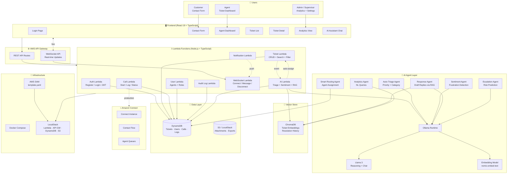
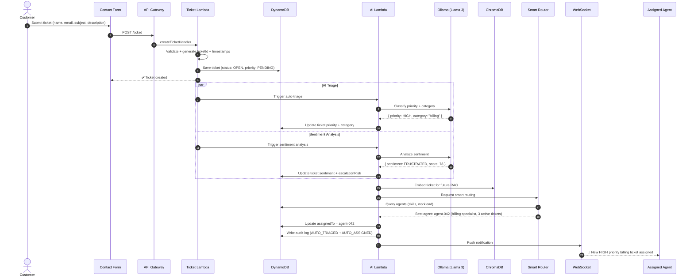
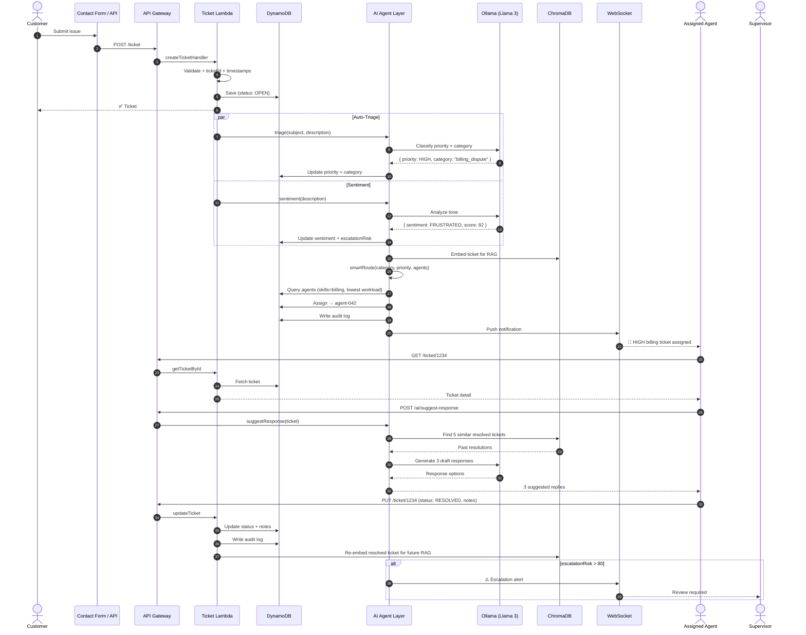

# NexusDesk — Implementation Plan

> **NexusDesk** — AI-powered contact center intelligence. A serverless ticketing, call management, and customer operations platform with AI agents for auto-triage, sentiment analysis, and intelligent ticket routing — running on AWS Lambda + DynamoDB via LocalStack.

---

## 1. Product Vision

**NexusDesk** is a full-stack contact center platform that manages customer tickets, agent workflows, and call operations — all backed by **AI agents** that auto-classify tickets, analyze customer sentiment, suggest responses, and predict escalations before they happen.

Built on a **serverless-first** architecture (AWS Lambda + DynamoDB + API Gateway), the entire stack runs locally via **LocalStack + SAM** for zero-cost development. AI features run via **Ollama** (local LLM) for privacy-first inference, with optional cloud LLM routing for production.

---

## 2. Key Features

### Ticket Management
- 🎫 **Full ticket lifecycle** — create, update, assign, resolve, close with status tracking
- 🔍 **Search & filter** — by status, priority, assignee, date range
- 📋 **Ticket detail view** — full history, notes, call logs, AI analysis
- 👤 **Agent assignment** — manual + AI-suggested routing
- ⏱️ **SLA tracking** — response time, resolution time, breach alerts

### Call Management (Amazon Connect)
- 📞 **Click-to-call** — initiate calls from ticket view
- 📊 **Call logging** — duration, status, agent, linked ticket
- 🔄 **Call status tracking** — initiated → ringing → connected → completed
- 📝 **Post-call notes** — auto-linked to ticket timeline

### Customer Operations
- 📬 **Contact form intake** — public-facing form → auto-ticket creation
- 👥 **Customer profiles** — contact history, ticket history, sentiment trend
- 📊 **Agent dashboard** — open tickets, active calls, performance KPIs
- 🔔 **Real-time notifications** — new tickets, assignments, escalations

### AI Agents (Planned)
- 🤖 **Auto-Triage Agent** — classify priority + category from ticket content
- 💬 **Sentiment Analysis Agent** — detect customer frustration, urgency, satisfaction
- ✍️ **Response Suggestion Agent** — draft replies using RAG over past resolutions
- 🚨 **Escalation Prediction Agent** — flag tickets likely to escalate before they do
- 📊 **Analytics Agent** — natural language queries over operational data
- 🔄 **Smart Routing Agent** — assign tickets to best-fit agent by skill + workload

### Enterprise & Compliance
- 🔐 **JWT authentication** — registration, login, protected routes
- 👮 **Role-based access** — Admin, Agent, Supervisor roles
- 📜 **Audit trail** — every action logged with user, timestamp, details
- 📈 **Analytics dashboard** — ticket volume, resolution time, agent performance

---

## 3. High-Level Architecture



### 3.1 Frontend Layer
- **React 19 + TypeScript** — component-based UI with type safety
- **Axios** — HTTP client for API calls
- **React Router** — client-side routing with protected routes
- **State management** — Zustand or React Context for auth/ticket state
- **UI library** — MUI or Ant Design for rapid component development

### 3.2 API & Compute Layer
- **AWS SAM** — infrastructure-as-code for Lambda + API Gateway + DynamoDB
- **AWS Lambda (Node.js 18 + TypeScript)** — serverless handlers per domain
- **API Gateway** — REST routes + WebSocket for real-time
- **LocalStack** — full AWS emulation for local development (zero-cost)

### 3.3 Data Layer
- **DynamoDB** — primary data store with GSIs for flexible queries
- **S3** — file attachments, exports, call recordings
- **ChromaDB** — vector store for AI agent RAG pipeline

### 3.4 AI Layer
- **Ollama** — local LLM runtime (no cloud API dependency)
- **Llama 3** — primary reasoning model for triage, sentiment, response generation
- **nomic-embed-text** — embeddings for ticket similarity + RAG
- **RAG pipeline** — embed tickets → vector search → context retrieval → LLM generation

### 3.5 Call Layer (Amazon Connect)
- **Local** — mock `startCallHandler` returning simulated responses
- **Production** — AWS SDK for Connect, real contact flows + agent queues

---

## 4. Tech Stack

### 4.1 Frontend
| Layer | Choice | Purpose |
|---|---|---|
| **Framework** | React 19 + TypeScript | UI framework |
| **Build** | Vite | Fast HMR, optimized builds |
| **Routing** | React Router v7 | Client-side navigation + protected routes |
| **HTTP client** | Axios | API calls with interceptors |
| **State** | Zustand (or Context) | Auth state, ticket cache |
| **UI library** | MUI v6 or Ant Design | Component library |
| **Forms** | React Hook Form + Zod | Validation |
| **Charts** | Recharts | Dashboard analytics |
| **Real-time** | Native WebSocket | Live ticket updates |
| **Testing** | Vitest + Playwright | Unit + E2E |

### 4.2 Backend
| Layer | Choice | Purpose |
|---|---|---|
| **Runtime** | Node.js 18 + TypeScript | Lambda execution |
| **IaC** | AWS SAM (template.yaml) | Lambda + API GW + DynamoDB definition |
| **Bundler** | esbuild | Fast TypeScript → JS compilation |
| **Local emulation** | LocalStack | DynamoDB, Lambda, API GW, S3 locally |
| **Database** | DynamoDB | Serverless NoSQL, single-table design |
| **Object storage** | S3 (via LocalStack) | Attachments, exports |
| **Auth** | Custom JWT (jsonwebtoken + bcrypt) | Stateless authentication |
| **Validation** | Zod | Request schema validation |
| **Logging** | Custom logger utility | Structured request/error logging |
| **SDK** | AWS SDK v3 | DynamoDB, S3, Lambda, Connect clients |

### 4.3 AI / LLM Stack
| Layer | Choice | Purpose |
|---|---|---|
| **LLM runtime** | **Ollama** | Local model serving, air-gapped capable |
| **Primary LLM** | **Llama 3 8B** | Triage, sentiment, response drafting, analytics |
| **Fast LLM** | **Llama 3 8B Q4** (quantized) | High-volume classification, quick triage |
| **Embeddings** | **nomic-embed-text** via Ollama | Ticket + resolution embeddings |
| **Vector store** | **ChromaDB** | Semantic search over ticket history |
| **RAG pipeline** | Custom (embed → search → retrieve → generate) | Context-aware AI responses |
| **Structured output** | Zod schemas + JSON mode | Reliable triage/sentiment JSON |
| **Agent framework** | Custom agent loop (or LangChain.js) | Multi-agent orchestration |
| **Tracing** | Langfuse (optional) | LLM observability |

**LLM routing strategy:** All inference local via Ollama. For production, optionally route complex reasoning to Claude/GPT-4.1 via LiteLLM.

### 4.4 RAG Pipeline
| Layer | Choice |
|---|---|
| **Embeddings** | `nomic-embed-text` via Ollama (768-dim) |
| **Vector store** | ChromaDB (local, persistent) |
| **Indexed corpora** | (1) Resolved tickets, (2) Agent notes, (3) Knowledge base articles, (4) Call transcripts |
| **Retrieval** | Vector similarity (cosine) → top-k → LLM |
| **Refresh** | Incremental indexing on ticket resolve/close |

### 4.5 Infrastructure
| Layer | Choice |
|---|---|
| **Local dev** | LocalStack + SAM CLI + Docker Compose |
| **Cloud** | AWS (Lambda, DynamoDB, S3, API Gateway, Connect) |
| **Containerization** | Docker (LocalStack, Ollama, ChromaDB) |
| **CI/CD** | GitHub Actions |
| **Monitoring** | CloudWatch (prod), console logging (local) |

---

## 5. DynamoDB Table Design

### Tickets Table
| Field | Type | Key |
|---|---|---|
| `ticketId` | String | PK |
| `customerName` | String | |
| `customerEmail` | String | |
| `subject` | String | |
| `description` | String | |
| `status` | String (OPEN / IN_PROGRESS / RESOLVED / CLOSED) | GSI2-PK |
| `priority` | String (LOW / MEDIUM / HIGH / CRITICAL) | |
| `category` | String (AI-classified) | |
| `assignedTo` | String (userId) | GSI1-PK |
| `sentiment` | String (POSITIVE / NEUTRAL / FRUSTRATED / ANGRY) | |
| `escalationRisk` | Number (0–100) | |
| `createdAt` | String (ISO) | GSI1-SK, GSI2-SK |
| `updatedAt` | String (ISO) | |

**GSI1:** `assignedTo` (PK) + `createdAt` (SK) — tickets by agent
**GSI2:** `status` (PK) + `createdAt` (SK) — tickets by status

### Users Table
| Field | Type | Key |
|---|---|---|
| `userId` | String | PK |
| `email` | String | GSI1-PK |
| `password` | String (hashed) | |
| `role` | String (ADMIN / AGENT / SUPERVISOR) | |
| `status` | String (ACTIVE / DISABLED) | |
| `skills` | String[] | |
| `activeTickets` | Number | |
| `createdAt` | String (ISO) | |
| `updatedAt` | String (ISO) | |

### Calls Table
| Field | Type | Key |
|---|---|---|
| `callId` | String | PK |
| `ticketId` | String | |
| `agentId` | String (userId) | GSI1-PK |
| `customerNumber` | String | |
| `status` | String (INITIATED / RINGING / CONNECTED / COMPLETED) | |
| `duration` | Number (seconds) | |
| `startTime` | String (ISO) | GSI1-SK |
| `endTime` | String (ISO) | |
| `notes` | String | |

### Audit Logs Table
| Field | Type | Key |
|---|---|---|
| `logId` | String | PK |
| `ticketId` | String | GSI1-PK |
| `action` | String (CREATED / UPDATED / ASSIGNED / COMMENT / ESCALATED) | |
| `message` | String | |
| `createdBy` | String (userId) | |
| `createdAt` | String (ISO) | GSI1-SK |

---

## 6. AI Agent Architecture

### 6.1 Agent Definitions

| Agent | Input | Output | Trigger |
|---|---|---|---|
| **Auto-Triage** | Ticket subject + description | Priority (LOW/MED/HIGH/CRIT) + category | On ticket creation |
| **Sentiment Analysis** | Ticket description + notes | Sentiment label + score (0–100) + frustrated flag | On ticket creation/update |
| **Response Suggestion** | Ticket context + similar resolved tickets (RAG) | 2–3 draft response options | Agent opens ticket |
| **Escalation Prediction** | Ticket history + sentiment trend + SLA status | Escalation risk score (0–100) + reason | Periodic (every 5 min) + on update |
| **Smart Routing** | Ticket category + priority + agent skills + workload | Best-fit agent ID + reason | On ticket creation (after triage) |
| **Analytics** | Natural language query | Structured answer with data | On-demand (chat) |

### 6.2 Auto-Triage Flow



### 6.3 Response Suggestion Flow

```
Agent opens ticket
        ↓
Embed ticket subject + description (nomic-embed-text)
        ↓
Vector search ChromaDB (top-k=5 similar resolved tickets)
        ↓
Retrieve resolution notes from matched tickets
        ↓
Build prompt: "Given this ticket and these past resolutions, draft 3 responses"
        ↓
LLM generates 3 response options (Llama 3)
        ↓
Agent selects, edits, and sends
```

---

## 7. API Design

```
# Auth
POST   /auth/register          # Create account
POST   /auth/login             # Login → JWT
GET    /auth/me                # Current user profile

# Tickets
POST   /ticket                 # Create ticket
GET    /tickets                # List tickets (filter: status, assignedTo, priority)
GET    /ticket/:id             # Get ticket detail
PUT    /ticket/:id             # Update ticket (status, priority, assignedTo)
DELETE /ticket/:id             # Delete ticket (admin only)

# Calls
POST   /call                   # Initiate call (mock → Connect)
GET    /calls                  # List call logs
GET    /call/:id               # Get call detail

# AI
POST   /ai/triage              # Manual triage trigger
POST   /ai/sentiment           # Analyze ticket sentiment
POST   /ai/suggest-response    # Get draft responses (RAG)
GET    /ai/escalation-risk/:id # Get escalation risk score
POST   /ai/chat                # Natural language analytics query

# Audit
GET    /logs                   # Audit logs (filter: ticketId, action, user)

# Users
GET    /users                  # List agents (admin/supervisor)
PUT    /user/:id               # Update user role/status

# Contact (Public)
POST   /contact                # Public contact form → auto-create ticket
```

---

## 8. Frontend Folder Structure

```
frontend/
├── public/
├── src/
│   ├── pages/
│   │   ├── LoginPage.tsx
│   │   ├── ContactFormPage.tsx
│   │   ├── DashboardPage.tsx
│   │   ├── TicketListPage.tsx
│   │   ├── TicketDetailPage.tsx
│   │   ├── AnalyticsPage.tsx
│   │   ├── AIChatPage.tsx
│   │   └── SettingsPage.tsx
│   ├── components/
│   │   ├── ui/                  # Button, Card, Modal, Badge, Input
│   │   ├── layout/              # Navbar, Sidebar, PageLayout
│   │   ├── tickets/             # TicketCard, TicketList, TicketForm, TicketTimeline
│   │   ├── dashboard/           # StatCard, KPIWidget, AgentStatusList
│   │   ├── charts/              # TicketVolumeChart, ResolutionTimeChart
│   │   ├── ai/                  # AIChatPanel, SentimentBadge, TriageBadge, SuggestedResponses
│   │   └── calls/               # CallButton, CallLog, CallStatus
│   ├── services/
│   │   ├── api.ts               # Axios instance + interceptors
│   │   ├── websocket.ts         # WebSocket client
│   │   └── auth.ts              # Token storage + helpers
│   ├── stores/
│   │   ├── authStore.ts         # User + JWT state
│   │   ├── ticketStore.ts       # Ticket list + filters
│   │   ├── dashboardStore.ts    # KPI data
│   │   └── aiChatStore.ts       # Chat messages
│   ├── hooks/
│   │   ├── useAuth.ts
│   │   ├── useTickets.ts
│   │   └── useWebSocket.ts
│   ├── lib/
│   │   ├── utils.ts
│   │   └── constants.ts
│   ├── types/
│   │   ├── ticket.ts
│   │   ├── user.ts
│   │   ├── call.ts
│   │   └── api.ts
│   ├── App.tsx
│   └── main.tsx
├── .env
├── vite.config.ts
├── tsconfig.json
└── package.json
```

---

## 9. Backend Folder Structure

```
backend/
├── template.yaml                # SAM template (Lambda + API GW + DynamoDB)
├── docker-compose.yml           # LocalStack + Ollama + ChromaDB
├── src/
│   ├── handlers/
│   │   ├── auth/
│   │   │   ├── register.ts
│   │   │   ├── login.ts
│   │   │   └── me.ts
│   │   ├── tickets/
│   │   │   ├── createTicket.ts
│   │   │   ├── getTickets.ts
│   │   │   ├── getTicketById.ts
│   │   │   ├── updateTicket.ts
│   │   │   └── deleteTicket.ts
│   │   ├── calls/
│   │   │   ├── startCall.ts
│   │   │   ├── listCalls.ts
│   │   │   └── getCall.ts
│   │   ├── ai/
│   │   │   ├── triage.ts
│   │   │   ├── sentiment.ts
│   │   │   ├── suggestResponse.ts
│   │   │   ├── escalationRisk.ts
│   │   │   └── chat.ts
│   │   ├── logs/
│   │   │   └── getLogs.ts
│   │   ├── users/
│   │   │   ├── listUsers.ts
│   │   │   └── updateUser.ts
│   │   ├── contact/
│   │   │   └── submitContact.ts
│   │   └── websocket/
│   │       ├── connect.ts
│   │       ├── message.ts
│   │       └── disconnect.ts
│   ├── services/
│   │   ├── ticketService.ts     # createTicket(), getTickets(), updateTicket()
│   │   ├── userService.ts       # createUser(), getUser(), validatePassword()
│   │   ├── callService.ts       # startCall(), logCall()
│   │   ├── dynamodb.ts          # DynamoDB client (LocalStack / AWS auto-detect)
│   │   ├── s3.ts                # S3 client
│   │   ├── ollama.ts            # Ollama API client
│   │   ├── chromadb.ts          # ChromaDB client
│   │   └── rag.ts               # RAG pipeline service
│   ├── middleware/
│   │   ├── auth.ts              # JWT verification
│   │   ├── rbac.ts              # Role-based access control
│   │   └── validator.ts         # Zod request validation
│   ├── utils/
│   │   ├── response.ts          # successResponse(), errorResponse()
│   │   ├── errors.ts            # Custom error classes
│   │   ├── jwt.ts               # Token sign/verify
│   │   ├── logger.ts            # Structured logging
│   │   └── config.ts            # Environment config loader
│   ├── types/
│   │   ├── ticket.ts            # Ticket, CreateTicketInput, UpdateTicketInput
│   │   ├── user.ts              # User, LoginInput, RegisterInput
│   │   ├── call.ts              # Call, StartCallInput
│   │   └── api.ts               # ApiResponse, ApiError
│   └── agents/
│       ├── triageAgent.ts       # Auto-priority + category classification
│       ├── sentimentAgent.ts    # Frustration detection + scoring
│       ├── responseAgent.ts     # RAG-based response suggestion
│       ├── escalationAgent.ts   # Risk prediction
│       ├── routingAgent.ts      # Smart agent assignment
│       └── analyticsAgent.ts    # NL query over operational data
├── tsconfig.json
└── package.json
```

---

## 10. Delivery Roadmap (Phased)

### Phase 1 — Infrastructure & Project Setup
- Project root folder + Git + .gitignore
- Frontend + backend + infrastructure + docker directories
- Docker Compose (LocalStack, Ollama, ChromaDB)
- SAM template.yaml (Lambda + API GW + DynamoDB tables)
- LocalStack running with Lambda, API Gateway, DynamoDB, S3
- `sam build` + `samlocal deploy` working

### Phase 2 — Frontend Foundation
- React 19 + TypeScript + Vite initialization
- Dependencies (Axios, React Router, MUI/Ant Design)
- Environment variables (.env)
- Base layout (Navbar, Sidebar, PageLayout)
- Login page + contact form page + ticket dashboard page
- Ticket list component + ticket detail view
- Loading + error states
- Axios API service instance

### Phase 3 — Backend Core
- Node.js + TypeScript project with SAM
- TypeScript config (ES2020, strict, outDir: dist)
- Project structure (handlers, services, utils, types)
- DynamoDB client config (LocalStack auto-detect via IS_LOCAL)
- Response helpers (successResponse, errorResponse)
- Input validation (Zod schemas for tickets, enums)
- Environment config loader (TABLE_NAME, AWS_REGION, IS_LOCAL, etc.)
- Logger utility
- Type definitions (Ticket, User, Call, Log interfaces)

### Phase 4 — Ticket CRUD + Service Layer
- `createTicketHandler` — validate, generate ID, save to DynamoDB
- `getTicketsHandler` — list with filters (status, assignedTo) + pagination
- `updateTicketHandler` — update fields, set updatedAt
- `ticketService` — business logic separated from handlers
- SAM API routes wired (POST /ticket, GET /tickets, PUT /ticket/{id})
- Connect frontend → POST /ticket, GET /tickets

### Phase 5 — Authentication & RBAC
- JWT auth (register, login, token generation)
- Auth middleware for protected Lambda routes
- Frontend login flow (store token, redirect)
- Protected routes (ProtectedRoute wrapper)
- RBAC middleware (Admin, Agent, Supervisor permissions)
- Logout functionality

### Phase 6 — Calls & Audit Logs
- Mock `startCallHandler` (POST /call → simulated response)
- Call log storage (DynamoDB Calls table)
- Audit log Lambda (write action logs on every mutation)
- Notes/logs table CRUD
- Frontend call button + call log display

### Phase 7 — Real-Time & Notifications
- API Gateway WebSocket API (SAM config)
- WebSocket Lambda handlers (connect, message, disconnect)
- Frontend WebSocket client with reconnection
- Live ticket update push
- New assignment notifications
- Escalation alerts

### Phase 8 — AI Infrastructure
- Ollama setup + Docker Compose integration
- Pull Llama 3 + nomic-embed-text models
- AI service layer (services/ollama.ts)
- ChromaDB setup + Docker Compose
- ChromaDB service layer (services/chromadb.ts)
- Embedding pipeline (ticket text → nomic-embed → ChromaDB)
- RAG service (services/rag.ts)

### Phase 9 — AI Agents
- **Auto-Triage Agent** — classify priority + category on ticket creation
- **Sentiment Analysis Agent** — detect frustration/urgency
- **Response Suggestion Agent** — RAG-based draft replies
- **Escalation Prediction Agent** — flag high-risk tickets
- **Smart Routing Agent** — auto-assign to best-fit agent
- **Analytics Agent** — natural language queries over data
- AI chat UI in frontend

### Phase 10 — Testing & Quality
- Unit tests (backend handlers + services)
- API integration tests (LocalStack endpoints)
- Frontend component tests (Vitest)
- E2E tests (Playwright)
- SAM local invoke + local start-api verification
- DynamoDB data persistence verification

### Phase 11 — Deployment & CI/CD
- AWS account + IAM roles setup
- Deploy backend via SAM to AWS
- Create production DynamoDB tables
- Setup API Gateway routes (production)
- Build + deploy frontend (S3 or Vercel)
- GitHub Actions CI/CD pipeline (install → test → build → deploy)

### Phase 12 — Polish & Enhancements
- Clean code + refactor
- Error handling improvements
- Performance optimization
- Analytics dashboard (charts, KPIs)
- Ticket filtering + sorting UI
- Agent assignment logic improvements
- Documentation (README, API docs)

### Phase 13 — AWS Connect & Voice
- Full Amazon Connect integration (real calls, IVR, queue routing)
- Call recording + transcription + AI summarization
- Real-time agent status synchronization
- Contact center metrics & reporting dashboard
- Call routing based on contact attributes + AI triage

### Phase 14 — Multi-Channel Communication
- Email channel integration (inbound email → auto-ticket)
- Live chat widget (customer-facing, embedded)
- Self-service chatbot (customer-facing, RAG-powered)
- Mobile agent app (React Native)

### Phase 15 — Advanced Analytics & Monitoring
- Advanced analytics (CSAT scores, agent leaderboard, SLA compliance)
- CloudWatch + X-Ray distributed tracing (production monitoring)
- Custom application metrics + alerting
- Automated DynamoDB backups + point-in-time recovery

### Phase 16 — Enterprise & Security
- AWS Cognito migration (OIDC/SAML for enterprise SSO)
- Multi-language support (AI translation)
- CRM integrations (Salesforce, HubSpot)
- Knowledge base management UI
- Multi-tenant architecture (agency/org isolation)

---

## 11. Per-Ticket Lifecycle Flow



---

## 12. Naming Notes

**NexusDesk** = *Nexus* (connection hub) + *Desk* (help desk) — the AI-powered nerve center connecting customers, agents, and intelligent automation.

---

## 13. Future Roadmap

- 🎙️ Voice analytics + sentiment from call audio
- 📊 Predictive staffing (AI forecasts ticket volume → recommends agent scheduling)
- 🔁 Workflow automation builder (visual drag-and-drop ticket pipelines)
- 🧪 A/B testing for AI response quality
- 🌍 Multi-region deployment (AWS Global)
- 📦 Plugin / extension marketplace for custom integrations


