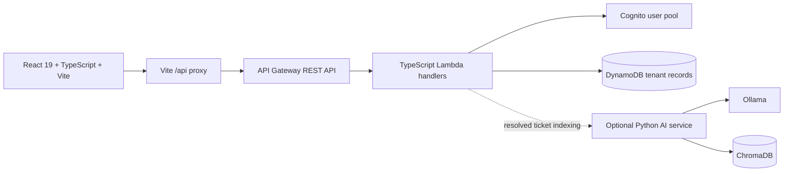

# NexusDesk

NexusDesk is a contact center application with a React frontend, a serverless
TypeScript API, Cognito authentication, and tenant-scoped DynamoDB records.
Local development uses **Floci** to run the AWS services on port **4566**.

The frontend foundation includes login, a dashboard, ticket list and detail
views, an authenticated contact form, shared navigation, and loading and error
states. Phases 3–6 include validated ticket CRUD with pagination and assignment
filters, stored-profile RBAC, simulated calls, ticket notes, and transactional
audit logs. Real telephony, advanced analytics, notifications, and AI workflows
remain later delivery work; some dashboard metrics are labeled as demo values.

See [FLOCI.md](FLOCI.md) for detailed Windows setup and troubleshooting.
See [MANUAL_TESTING.md](MANUAL_TESTING.md) for startup commands and the manual login, logout, and ticket test checklist.
For a conventional deployment alternative, see the
[Non-Serverless Migration Plan](NON_SERVERLESS_MIGRATION_PLAN.md).

## Start locally (Windows / PowerShell)

Install Docker Desktop with Linux containers, Node.js 20 or newer, AWS CLI v2,
AWS SAM CLI, and Python. The commands must be available in a new PowerShell
window. Install the SAM endpoint wrapper once:

```powershell
python -m pip install aws-sam-cli-local
samlocal --version
```

Deploy the backend and start the infrastructure:

```powershell
cd D:\NexusDesk
docker desktop start
.\deploy.ps1 -Local
```

The deployment script installs and bundles the backend, builds the SAM template,
starts Floci/Ollama/ChromaDB, deploys the stack through Floci, creates local
Cognito groups, and runs infrastructure checks. `samlocal` is the endpoint
wrapper; the AWS emulator is Floci. The scripts use temporary dummy AWS
credentials and restore the previous process environment afterward.

Run the frontend in a separate PowerShell window:

```powershell
cd D:\NexusDesk
.\start-ui.ps1
```

Keep that terminal open and visit [http://localhost:5173/login](http://localhost:5173/login).
The startup script reads the deployed API endpoint from CloudFormation and
passes it to Vite's `/api` proxy. You do not need to copy API IDs into `.env`.

For daily startup after the first deployment:

```powershell
cd D:\NexusDesk
docker desktop start
docker compose up -d floci ollama chroma
.\start-ui.ps1
```

Rerun `.\deploy.ps1 -Local` after backend or SAM changes. Restart
`.\start-ui.ps1` after deploying because the API ID can change. Frontend source
edits reload automatically through Vite.

## Local administrator account

The UI provides a login page. Initial tenant registration is an API operation.
On a fresh local database, run this once while the frontend is running:

```powershell
$body = @{
    tenantName = 'Local Demo'
    adminEmail = 'admin@localhost.com'
    adminPassword = 'Admin123!'
    adminFirstName = 'Local'
    adminLastName = 'Admin'
} | ConvertTo-Json
Invoke-RestMethod http://localhost:5173/api/tenants/register -Method Post -ContentType application/json -Body $body
```

Sign in at `/login` with `admin@localhost.com` and `Admin123!`. These are example
credentials for the local emulator. If this account already exists, use its
existing login. The browser page is `/login`; `/api/auth/login` accepts a
**POST** request containing email and password.

## Frontend and authentication

| Browser route | Purpose |
|---|---|
| `/login` | Email/password login with remember-me support |
| `/dashboard` | Ticket dashboard within the shared header/sidebar layout |
| `/contact` | Authenticated contact form that creates a ticket |
| `/tickets` | Ticket table, filters, selection, and editable detail panel |
| `/calls` | Saved simulated calls and end-call controls |
| `/audit` | Tenant audit logs for admins and supervisors |

The contact form sends `POST /ticket` through the API service with the signed-in
user's access token. The backend assigns the tenant from the authenticated
identity. Public customer intake is future work. The ticket detail panel uses
`PUT /ticket/{id}` to save descriptions and valid status transitions;
resolving a ticket requires a resolution.

Axios uses `VITE_API_URL`, normally `/api` for local development. Vite reads
`BACKEND_API_URL` for the proxy target; `start-ui.ps1` resolves this from the
stack. `.env.example` documents frontend variables. Restart Vite after changing
environment variables. Browser-visible `VITE_*` values must not contain secrets.

Login stores Cognito tokens in session storage, or local storage when
**Remember me** is selected. The app restores valid sessions, removes malformed
or expired records, and checks expiry on focus and with an expiry timer. Logout
calls `POST /auth/logout` to revoke Cognito sessions, then clears the session
and ticket cache and returns to the login page. If the API is unavailable,
logout shows an error so revocation can be retried. Responses
from an earlier session cannot repopulate its ticket data or cancel a newer
login. JWT decoding restores UI state; the backend verifies signatures and
permissions on protected requests.

## Architecture


```mermaid
flowchart LR
    Browser[React 19 + TypeScript + Vite]
    Proxy[Vite /api proxy]
    Gateway[API Gateway REST API]
    Lambda[TypeScript Lambda handlers]
    Cognito[Cognito user pool]
    Data[(DynamoDB tenant records)]
    AI[Optional Python AI service]
    Ollama[Ollama]
    Chroma[(ChromaDB)]

    Browser --> Proxy --> Gateway --> Lambda
    Lambda --> Cognito
    Lambda --> Data
    Lambda -. resolved ticket indexing .-> AI
    AI --> Ollama
    AI --> Chroma
```

Floci hosts local API Gateway, Lambda, Cognito, DynamoDB, CloudFormation, and
S3 resources. AWS SAM describes the deployment in
[`infrastructure/template.yaml`](infrastructure/template.yaml). The root Compose
file starts Floci, Ollama, and ChromaDB. It does not start the Python AI
application or download LLM models; those need separate setup.

| Layer | Current implementation |
|---|---|
| Frontend | React 19, TypeScript, Vite, React Router, Axios, Zustand |
| UI | Tailwind CSS, Lucide icons, MUI |
| API | TypeScript, AWS Lambda, API Gateway, esbuild, AWS SAM |
| Authentication | Cognito email/password login and JWT verification |
| Data | DynamoDB Users, Tickets, Tenants, Calls, and Logs tables |
| Attachments | S3 bucket provisioned by SAM |
| Local AWS services | Floci at `http://localhost:4566` |
| AI service | Python/FastAPI source with Ollama and ChromaDB integrations |

Tenant-owned records use a `TENANT#<tenantId>` partition key and entity sort
keys such as `USER#<userId>` and `TICKET#<ticketId>`. Tickets carry customer
name/email, subject, description, status, timestamps, and an optional resolution.
Users carry email, first/last name, role, and status. Cognito manages passwords.
The Calls table stores simulated call lifecycles; Logs stores ticket notes and
immutable audit records. Ticket, call, note, tenant, and user writes include
their audit records in the same DynamoDB transaction.

## REST API

Paths below are relative to the deployed API endpoint. With Vite running, prefix
them with `http://localhost:5173/api`. Authentication uses
`Authorization: Bearer <accessToken>`.

| Method | Path | Access / behavior |
|---|---|---|
| GET | `/ping` | Public health check |
| POST | `/tenants/register` | Public tenant and initial administrator registration |
| POST | `/auth/login` | Public email/password login; returns Cognito tokens |
| POST | `/auth/signup` | Alias for creating a new tenant and its administrator |
| POST | `/auth/register` | Alias for creating a new tenant and its administrator |
| POST | `/auth/logout` | Authenticated Cognito global sign-out |
| POST | `/auth/confirm` | Public signup confirmation |
| POST | `/auth/refresh` | Public refresh-token exchange |
| GET | `/me` | Authenticated caller's profile |
| POST | `/users` | Admin creates a user |
| GET | `/users` | Supervisor/admin lists tenant users |
| GET | `/users/{userId}` | Supervisor/admin tenant user lookup |
| PATCH | `/users/{userId}` | Admin updates a tenant user |
| POST | `/tickets` | Authenticated ticket creation |
| GET | `/tickets` | Authenticated tenant ticket list |
| GET | `/tickets/{ticketId}` | Authenticated ticket detail |
| PATCH | `/tickets/{ticketId}` | Authenticated ticket update |
| POST | `/ticket` | Alias for ticket creation |
| GET | `/ticket/{id}` | Alias for ticket detail |
| PUT | `/ticket/{id}` | Alias for ticket update |
| DELETE | `/ticket/{id}` | Supervisor/admin ticket deletion |
| POST | `/call` | Start and persist a simulated call for a ticket |
| GET | `/calls` | Tenant call list with pagination and optional ticket filter |
| PUT | `/call/{id}` | End own call; supervisors/admins can end tenant calls |
| POST / GET | `/notes` | Create/list ticket notes with pagination |
| PUT / DELETE | `/notes/{id}` | Owner or supervisor/admin edits/deletes a note |
| GET | `/logs` | Supervisor/admin tenant audit list with pagination |
| POST | `/logs` | Supervisor/admin manually records a labeled audit event |

Create-ticket bodies contain `customerName`, `customerEmail`, `subject`, and
`description`. Status updates follow the backend's allowed transitions; a
`resolved` update requires a `resolution`. Ticket lists accept `status`,
`assignedTo`, `limit` (1–100), and `nextToken`, and return `{ items, nextToken }`.
Filtered DynamoDB pages may be empty while still returning a continuation token.
Agents can assign tickets to themselves; supervisors/admins can assign active
tenant users. Public signup cannot choose an existing tenant or privileged role;
admins provision existing-tenant users with `POST /users` (including password).
WebSockets and public contact submission remain future work.

## AI direction

The Python source under `ai-service/` includes triage, sentiment, response
suggestion, escalation, routing, and analytics agents. These are separate from
the Phase 2 frontend foundation and require an AI application and downloaded
models to run.

The shared customer-context endpoint assembles two collections:

- `customer_history`: resolved tickets for the same customer and tenant,
  excluding the current ticket.
- `similar_resolutions`: useful resolved tickets for other customers within
  the same tenant.

Customer identity uses normalized email within a tenant. Cross-tenant records
must remain isolated. When a ticket is resolved, the backend can send its
subject, description, resolution, tenant, customer email, and timestamp to
`POST /ai/resolved-tickets` for indexing. Indexing failures are logged without
rolling back the saved ticket update.

Later delivery work includes automatic triage and assignment, suggested
responses in the UI, call integration with Amazon Connect,
real-time notifications, analytics, public intake, and production deployment.

## Project layout

```text
frontend/                 React app, pages, shared layout, API service, stores
backend/src/core/auth/    Cognito, JWT verification, roles, tenant resolution
backend/src/module/       Auth, tenant, user, ticket, call, log, and ping modules
infrastructure/           SAM template
docker/                   Local resource setup and verification scripts
ai-service/               Optional FastAPI agents and RAG services
deploy.ps1                Backend build and local/cloud deployment
start-ui.ps1              Stack-aware Vite startup
FLOCI.md                  Detailed local setup guide
```

## Checks and troubleshooting

Run the frontend checks:

```powershell
cd D:\NexusDesk\frontend
npm test
npm run lint
npm run build
```

Run the backend checks:

```powershell
cd D:\NexusDesk\backend
npm test
npm run typecheck
npm run build
```

The frontend authentication checks cover stored-session recovery, remember-me
storage, logout, token changes, late responses, and API error handling. These
checks complement the deployed API and browser verification described in
[FLOCI.md](FLOCI.md).

If the UI shows `Missing Authentication Token`, check the route, HTTP method,
and deployed API target. Restart the UI after a backend deployment so its proxy
uses the current API endpoint. Test
[http://localhost:5173/api/ping](http://localhost:5173/api/ping), and inspect
`docker compose logs floci` if the API is unavailable. Typing a POST API URL
into the browser address bar sends GET and will not sign you in.

| Service | Local address |
|---|---|
| Frontend | `http://localhost:5173` |
| Floci | `http://localhost:4566` |
| Ollama | `http://localhost:11434` |
| ChromaDB | `http://localhost:8001` |

Stop the frontend with **Ctrl+C**, then run `docker compose down` from the
workspace root. Named Docker volumes preserve local data. Adding `-v` deletes
those volumes and resets the local services.
